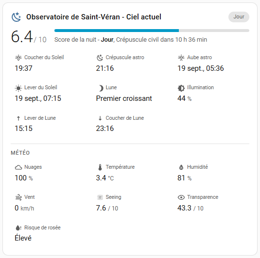
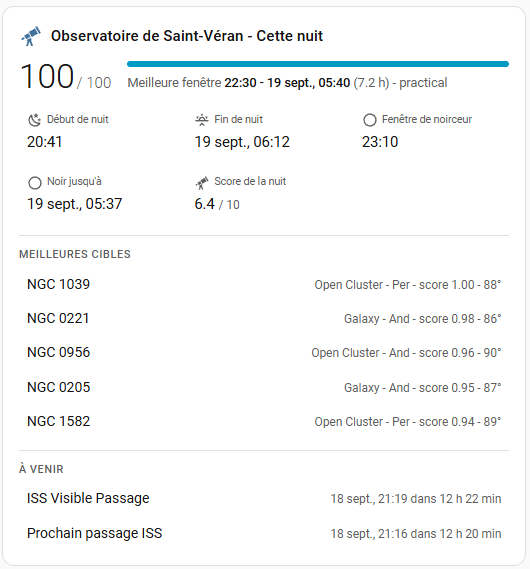
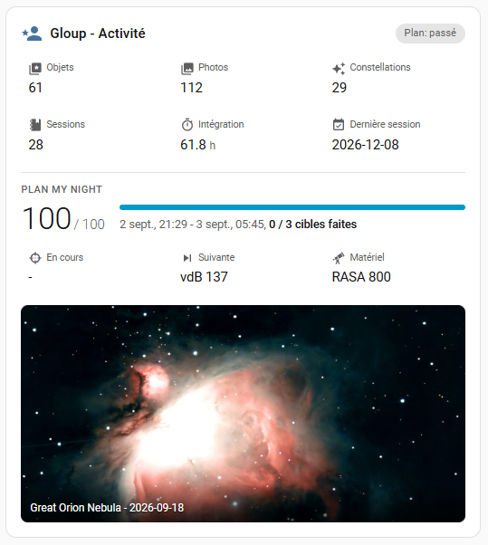

# MyAstroBoard Card

[](https://hacs.xyz)
[](LICENSE)

A Home Assistant Lovelace card for [MyAstroBoard](https://github.com/myastroboard/myastroboard).
It shows what the MyAstroBoard **MQTT / Home Assistant** connector publishes - sky conditions
and night score, tonight's best window and top targets, and your own Astrodex / Plan My Night
activity - in three ready-made layouts. No YAML on the MyAstroBoard side, no configuration
beyond the entity prefix on the Home Assistant side.

Requires **MyAstroBoard v1.6 or newer** with the MQTT connector enabled
([setup guide](https://github.com/myastroboard/myastroboard/blob/main/docs/HOME_ASSISTANT.md))
and **Home Assistant 2024.11 or newer**.

## Modes

### `sky` (default) - a location

Night score gauge, current sky period and the next one, sunset / astronomical dusk / dawn /
sunrise, Moon phase, illumination, rise and set, and (when the *Weather now* module is on)
clouds, temperature, humidity, wind, seeing, transparency, dew risk.

### `tonight` - a location

Night score gauge with the best window's hours and Moon condition, SkyTonight night window,
dark window, best-window score, the top 5 targets with type / constellation / AstroScore / max
altitude, next event, next ISS pass and next CSS pass.

### `activity` - a user

Astrodex objects / pictures / constellations, observation sessions and total integration, Plan
My Night progress with the current and next target and the equipment in use, and the latest
Astrodex picture.

Every tile opens the entity's *more info* dialog when clicked.

## Installation

### HACS (recommended)

1. HACS -> Dashboard -> three dots -> **Custom repositories**
2. Repository `https://github.com/myastroboard/lovelace-myastroboard-card`, category **Dashboard**
3. Install **MyAstroBoard Card**, reload the browser when HACS asks

HACS registers the resource automatically.

### Manual

1. Download `myastroboard-card.js` from the [latest release](https://github.com/myastroboard/lovelace-myastroboard-card/releases)
   into `config/www/`
2. Settings -> Dashboards -> three dots -> **Resources** -> add `/local/myastroboard-card.js` as
   a *JavaScript module*

## Configuration

Add the card from the dashboard editor (it is listed as *MyAstroBoard Card*). The visual editor
has a **Mode** selector and a **Device** selector listing the MyAstroBoard devices Home Assistant
discovered - locations for the *Sky now* / *Tonight* modes, users for *Activity* - so you cannot
point an activity card at a location. Nothing else is required.

In YAML, `device` is the Home Assistant device id the editor stores; `entity_prefix` is the
hand-written alternative:

```yaml
type: custom:myastroboard-card
mode: sky                              # sky | tonight | activity
device: 3f2a9c...                      # set by the visual editor (device registry id)
# entity_prefix: myastroboard_backyard # alternative to device, see below
title: Backyard                        # optional (defaults to "<device> - <mode>")
icon: mdi:telescope                    # optional
show_weather: true                     # sky mode, default true
show_picture: true                     # activity mode, default true
picture_height: 240                    # activity mode: thumbnail height in px (0 = natural size), default 240
picture_fit: cover                     # activity mode: cover (crop) | contain, default cover
top_targets: 5                         # tonight mode, default 5
```

The latest Astrodex picture is shown as a **cropped thumbnail of bounded height** (the editor
offers hidden / 160 / 240 / 400 px / natural size): at natural size a portrait photo would make
the card several screens tall. Clicking the thumbnail opens the full picture.

### `entity_prefix` (YAML fallback)

Home Assistant names the connector's entities after the device and the entity:
`sensor.myastroboard_backyard_observation_score`, `binary_sensor.myastroboard_backyard_astronomical_night`,
`image.myastroboard_alice_latest_astrodex_picture`. The prefix is everything before the entity
name:

| Device in Home Assistant | `entity_prefix` |
|---|---|
| MyAstroBoard - Backyard | `myastroboard_backyard` |
| MyAstroBoard - Mountain site | `myastroboard_mountain_site` |
| MyAstroBoard - alice (a user, `activity` mode) | `myastroboard_alice` |

With `device`, the card resolves its entities from the registry instead, so a renamed device
keeps working. A user device only exists once that user has switched *Publish my activity to
Home Assistant* on in MyAstroBoard (My settings -> Customize).

## Languages

Labels follow the Home Assistant user interface language: English, French, Spanish, German,
Italian and Portuguese (English otherwise). The translations are embedded in the card file -
there is nothing extra to install, and the manual installation above is unchanged. Values that
come from MyAstroBoard as enumerations (sky period, Moon phase, dew risk, plan state) are
translated too; free text such as target names is shown as published.

## Examples

- [`examples/dashboard-with-card.yaml`](examples/dashboard-with-card.yaml) - a dashboard built
  with this card (two locations + one user)
- [`examples/dashboard-core-cards.yaml`](examples/dashboard-core-cards.yaml) - the same
  information with **core** Home Assistant cards only, for people who do not want a custom card
- [`examples/automations.yaml`](examples/automations.yaml) - red light at astronomical dusk,
  "tonight looks good" notification, ISS pass announcement

## Preview

### Sky now



### Tonight



### Activity



Screenshots of the three card modes: sky conditions, tonight planning, and user activity.

## Entity reference

The full list of entities, their JSON keys and the MQTT topics is in the MyAstroBoard docs:
[HOME_ASSISTANT.md](https://github.com/myastroboard/myastroboard/blob/main/docs/HOME_ASSISTANT.md).

## Development

`dist/myastroboard-card.js` is a single, dependency-free ES file (a plain custom element, no Lit
bundle, no build step). Edit it directly, reload the dashboard (Ctrl+F5) to test. Releases are
GitHub releases tagged `vX.Y.Z` with the file attached; HACS reads the tag as the version.

## License

AGPL-3.0, like MyAstroBoard.
